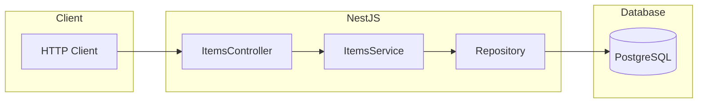
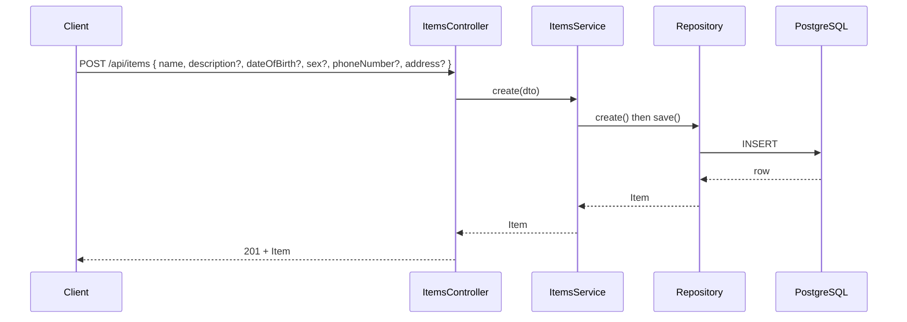

# Test Repo for Mocking Dependencies and Database Interactions in NestJS

Sample NestJS application with PostgreSQL (Docker), basic CRUD for an **Item** resource, and unit tests that mock dependencies and the TypeORM repository.

## Overview

This project demonstrates:

- A runnable NestJS API with TypeORM and PostgreSQL.
- **Controller tests** that mock `ItemsService` so only HTTP behaviour and delegation are tested.
- **Service tests** that mock the TypeORM `Repository<Item>` so business logic is tested without a real database.
- When to use `jest.fn()` versus `jest.spyOn()` in mocks.

## Features

- **Item CRUD**: Create, read all, read one by id, update by id, delete by id.
- **REST API**: Global prefix `/api`, items under `/api/items`. POST returns 201, delete returns 200, others 200.
- **JSON only**: POST, PATCH, and PUT require `Content-Type: application/json`. The request body must be valid JSON. Invalid JSON or wrong Content-Type returns 400 with a clear error message.
- **Encoding**: Only UTF-8 is supported. If a charset is declared, it must be UTF-8. Any other charset returns 400. If the body cannot be decoded (e.g. invalid UTF-8), the API returns 400 with a message that the body could not be decoded and to use UTF-8.
- **Validation**: Create item requires a non-empty `name`. Missing or invalid `name` returns 400. Item `id` in path must be a valid UUID (GET/PATCH/DELETE `/api/items/:id`); invalid format returns 400. `dateOfBirth`, when provided, must be a valid ISO date (YYYY-MM-DD) and a valid calendar date (e.g. `1989-11-31` returns 400).
- **PostgreSQL**: Entity `Item` (id UUID, name, description, dateOfBirth, sex, phoneNumber, address, createdAt, updatedAt). Database runs in Docker via `docker-compose`.
- **Unit tests**: Jest. Controller tests use a mock `ItemsService`, service tests use a mock `Repository<Item>`. Guard and filter tests in `src/common/`.
- **Documentation**: Inline comments. Documentation can be generated from the repo (see Scripts).

## Dependencies

### Runtime

- `@nestjs/common`, `@nestjs/core`, `@nestjs/platform-express`: NestJS framework.
- `@nestjs/typeorm`, `typeorm`, `pg`: TypeORM and PostgreSQL driver.
- `reflect-metadata`, `rxjs`: Required by NestJS.

### Development

- `@nestjs/cli`: NestJS CLI (fixed at ^11.0.16 for compatibility).
- `@nestjs/testing`: Testing utilities (`Test.createTestingModule`, etc.).
- `jest`, `ts-jest`: Test runner and TypeScript support.
- `typescript`: Compiler.
- `eslint`, `@eslint/js`, `@typescript-eslint/*`: Linting.
- Node.js v20 or later.

## Prerequisites

- Node.js v20 or later.
- Docker and Docker Compose (for running PostgreSQL locally).
- npm (or compatible package manager).

## Quick Start

1. **Install dependencies**

   ```bash
   npm install
   ```

2. **Start PostgreSQL** (optional, required for `npm run start` against a real DB)

   ```bash
   docker-compose up -d
   ```

3. **Configure environment** (optional)

   Copy `.env.example` to `.env` and adjust if needed. Defaults match `docker-compose.yml` (localhost, port 5432, user `nestjs_user`, database `nestjs_db`).

4. **Run the application**

   ```bash
   npm run start
   ```

   API base: `http://localhost:3000/api`. Items: `GET/POST /api/items`, `GET/PATCH/DELETE /api/items/:id`.

5. **Run tests** (no database required, mocks are used)

   ```bash
   npm run test
   ```

## Scripts

| Script | Description |
| ------ | ----------- |
| `npm run start` | Start the NestJS server (default port 3000). |
| `npm run start:dev` | Start with watch mode. |
| `npm run start:debug` | Start with debug and watch. |
| `npm run build` | Compile TypeScript to `dist/`. |
| `npm run test` | Run Jest unit tests. |
| `npm run test:watch` | Run tests in watch mode. |
| `npm run test:cov` | Run tests with coverage report. |
| `npm run lint` | Run ESLint on `src` and `test`. |
| `npm run doc` | Generate documentation from source comments. |

## Code Change Summary

- **Root**: `package.json` (NestJS 11, TypeORM, pg, Jest, ESLint, Node >=20, scripts for start, test, lint, doc), `tsconfig.json`, `nest-cli.json`, `tsconfig.build.json`, `docker-compose.yml`, `.env.example`, `eslint.config.mts`, `jest.config.ts`.
- **Application**: `src/main.ts` (bootstrap, `validateJsonContentType` middleware, global prefix `api`, global `JsonParseExceptionFilter` and `JsonContentTypeGuard`), `src/app.module.ts` (TypeORM forRoot, ItemsModule).
- **Common**: `src/common/validate-content-type.ts` (Content-Type and charset validation), `src/common/middleware/validate-json-content-type.middleware.ts` (Express middleware), `src/common/filters/json-parse-exception.filter.ts` (400 when request body is not valid JSON), `src/common/guards/json-content-type.guard.ts` (requires `Content-Type: application/json` for POST, PATCH, PUT).
- **Items feature**: `src/items/item.entity.ts` (TypeORM entity), `src/items/dto/create-item.dto.ts`, `src/items/dto/update-item.dto.ts`, `src/items/items.service.ts` (CRUD, name validation, UUID validation, date-of-birth validation), `src/items/items.controller.ts` (REST endpoints), `src/items/items.module.ts`.
- **Tests**: `src/items/items.controller.spec.ts`, `src/items/items.service.spec.ts`, `src/common/validate-content-type.spec.ts`, `src/common/middleware/validate-json-content-type.middleware.spec.ts`, `src/common/filters/json-parse-exception.filter.spec.ts`, `src/common/guards/json-content-type.guard.spec.ts`.

## Architecture



## Request Flow (Create Item)



## Test Strategy

- **Controller tests**: Replace `ItemsService` with a mock object whose methods are `jest.fn()`. Assert that the controller calls the service with the right arguments and returns the value from the mock. No real service or DB.
- **Service tests**: Replace `getRepositoryToken(Item)` with a mock repository object implementing `create`, `save`, `find`, `findOne`, `remove` as `jest.fn()`. Assert repository calls and that `NotFoundException` is thrown when `findOne` returns null.

## jest.fn() vs jest.spyOn()

- **jest.fn()**: Creates a new mock function with no implementation. Use when you need a **stand-in** for a dependency (e.g. entire service or repository). You control return values with `mockResolvedValue` / `mockReturnValue` and assert calls with `toHaveBeenCalledWith`. Used in this project for the mock `ItemsService` in controller tests and for the mock `Repository<Item>` in service tests.
- **jest.spyOn(object, 'methodName')**: Wraps an **existing** method on a real object so you can assert it was called or change its behaviour temporarily. Use when you still want the real object but need to observe or override one method. Not used in this repo because we replace whole dependencies (service, repository) with fakes. No real instance is present.

In short: use **jest.fn()** for full substitutes. Use **jest.spyOn()** when you have a real instance and only need to spy or stub one method.

## How to Test and Debug

### Running tests

- From project root: `npm run test`.
- Single file: `npx jest src/items/items.controller.spec.ts` (or the service spec).
- Watch mode: `npm run test:watch`.
- Coverage: `npm run test:cov`, report in `coverage/`.

### Debugging tests

- Run Jest with Node inspector: `node --inspect-brk node_modules/.bin/jest --runInBand src/items/items.controller.spec.ts`. Then attach your IDE debugger to the Node process.
- Or use VS Code/Cursor launch config: type "Node.js", attach to the process started with `--inspect-brk` as above.

### Running the app

- Start Postgres: `docker-compose up -d`. Check with `docker-compose ps`.
- Start app: `npm run start` or `npm run start:dev`.
- Call endpoints with curl or Postman, e.g. `curl -X POST http://localhost:3000/api/items -H "Content-Type: application/json" -d '{"name":"Test","description":"D","dateOfBirth":"1990-01-15","sex":"female","phoneNumber":"+44 20 7946 0958","address":"1 Victoria St, London"}'`.

### Linting

- `npm run lint` runs ESLint. Fix auto-fixable issues with `npm run lint -- --fix` if your setup supports it.

## Project Structure

```text
.
├── src/
│   ├── main.ts
│   ├── app.module.ts
│   ├── common/
│   │   ├── validate-content-type.ts
│   │   ├── validate-content-type.spec.ts
│   │   ├── filters/
│   │   │   ├── json-parse-exception.filter.ts
│   │   │   └── json-parse-exception.filter.spec.ts
│   │   ├── guards/
│   │   │   ├── json-content-type.guard.ts
│   │   │   └── json-content-type.guard.spec.ts
│   │   └── middleware/
│   │       ├── validate-json-content-type.middleware.ts
│   │       └── validate-json-content-type.middleware.spec.ts
│   └── items/
│       ├── item.entity.ts
│       ├── items.module.ts
│       ├── items.service.ts
│       ├── items.controller.ts
│       ├── items.controller.spec.ts
│       ├── items.service.spec.ts
│       └── dto/
│           ├── create-item.dto.ts
│           └── update-item.dto.ts
├── jest.config.ts
├── eslint.config.mts
├── nest-cli.json
├── tsconfig.json
├── tsconfig.build.json
├── package.json
├── docker-compose.yml
├── .env.example
├── Doxyfile
└── README.md
```

## Request Format (JSON)

For **POST**, **PATCH**, and **PUT**:

- Send the header `Content-Type: application/json`.
- Send the body as valid JSON.

If `Content-Type` is missing or not `application/json`, the API returns **400 Bad Request** with message: `Content-Type must be application/json. Send the request body in JSON format.`

If the body is not valid JSON (e.g. malformed), the API returns **400 Bad Request** with message: `Request body must be valid JSON.`

If the declared charset is not UTF-8 (e.g. `charset=iso-8859-1`), or the body cannot be decoded (e.g. invalid UTF-8), the API returns **400 Bad Request** with a message that the encoding is unsupported or the body could not be decoded, and to use UTF-8.

For **GET**, **PATCH**, and **DELETE** `/api/items/:id`, the `id` must be a valid UUID. Otherwise the API returns **400 Bad Request** with message: `Invalid UUID format.`

When `dateOfBirth` is present in the request body (POST or PATCH), it must be a valid ISO date string (YYYY-MM-DD) and a valid calendar date. Otherwise the API returns **400 Bad Request** with message: `Invalid date of birth; use ISO date format (YYYY-MM-DD).`

## Item Resource

Each item has:

| Field | Type | Description |
| ----- | ---- | ----------- |
| `id` | UUID | Assigned by the server (read-only). |
| `name` | string | Required on create, non-empty. |
| `description` | string | Optional, default empty. |
| `dateOfBirth` | date (ISO 8601) or null | Optional. Must be valid ISO date (YYYY-MM-DD) and valid calendar date when provided. |
| `sex` | string | Optional, default empty. |
| `phoneNumber` | string | Optional, default empty. |
| `address` | string | Optional, default empty. |
| `createdAt` | ISO 8601 datetime | Set by the server on create (read-only). |
| `updatedAt` | ISO 8601 datetime | Set by the server on create and on each update (read-only). |

## API Reference

| Method | Path | Description |
| ------ | ---- | ----------- |
| POST | /api/items | Create item. Body: `{ name: string }` required. Optional: `description?`, `dateOfBirth?` (ISO date string), `sex?`, `phoneNumber?`, `address?`. `name` must be non-empty. Invalid `dateOfBirth` returns 400. Returns 201 or 400. |
| GET | /api/items | List all items. Returns 200 + array. |
| GET | /api/items/:id | Get one item. Invalid UUID returns 400. Returns 200 or 404. |
| PATCH | /api/items/:id | Update item. Invalid UUID returns 400. Body: optional `name?`, `description?`, `dateOfBirth?`, `sex?`, `phoneNumber?`, `address?`. Invalid `dateOfBirth` returns 400. Returns 200 or 404. |
| DELETE | /api/items/:id | Delete item. Invalid UUID returns 400. Returns 200 or 404. |
